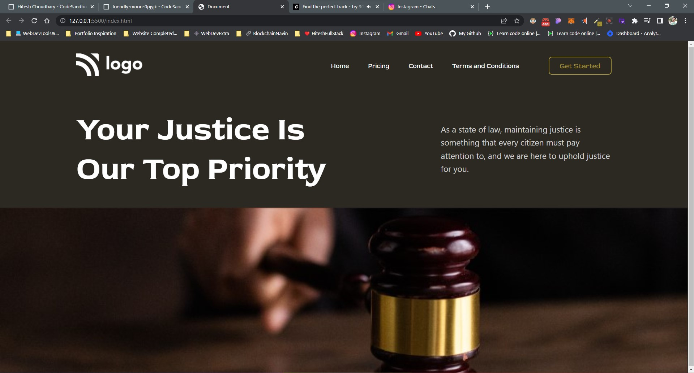

# Project 2 - HTML  and CSS 

By Shubham

Here's the Live Deployed Website 

[Link to the Project 3](https://courtjustice.netlify.app/)
https://courtjustice.netlify.app/

## What I learned from this Project?

- I learned about positioning around the webpage.
- I also learned how to add background and position them accordingly.
- I also learned how to add diffrent fonts from the Google Fonts
- I also learned how to design Buttons and Navbar.
- I also learned how to use margin and padding.

## This project took around 1.5 hours to complete.
